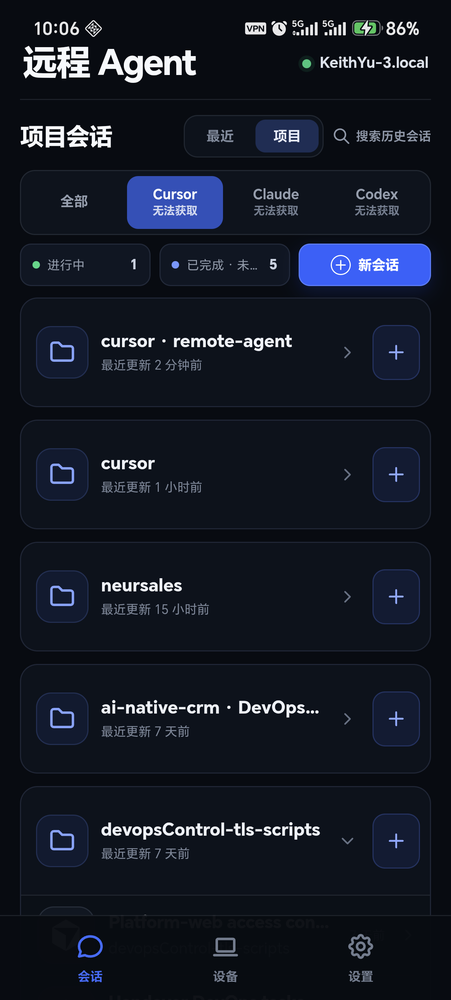
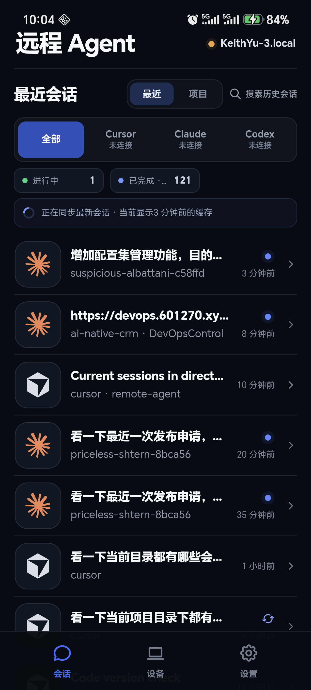

# Remote Agent

[](https://github.com/kipkcl2016/remote-agent/actions/workflows/release-artifacts.yml)

**Mac 上跑着 Cursor / Claude Code / Codex，人却不在电脑前——你想用手机遥控，又不想把代码打到公网中继。**  
**Your Mac runs coding agents while you're away. You want phone control—without shipping your repo through a public relay.**

**Remote Agent = 本机 macOS/Windows 网关 + 手机控制台。** 配对后在统一界面浏览会话、按项目开任务、看额度摘要；执行仍在你的电脑上，路径受白名单约束。  
**Remote Agent = a local macOS/Windows gateway + mobile console.** Pair once, then browse sessions, start tasks by project, and check usage—while agents keep running on your machine under a cwd whitelist.

### 安全边界 / Security boundary

- 工作目录白名单（`REMOTE_AGENT_ROOTS`）；符号链接逃逸会被拒绝  
- 一次性 6 位配对码 → 设备令牌；原生端进 Keychain / Keystore  
- **推荐 Tailscale 或受信任私网 + HTTPS**；**不要**把明文 HTTP 网关直接暴露到公网  
- Whitelist cwd · one-shot pairing codes · device tokens · prefer Tailscale/private net + HTTPS — do **not** expose plain HTTP to the public internet

<p align="center">
  
  
  
</p>

完整功能说明见 [docs/product/feature-guide.md](docs/product/feature-guide.md)。  
Full feature guide: [docs/product/feature-guide.md](docs/product/feature-guide.md).

---

## 和同类方案怎么选 / How it compares

诚实对照，不抹黑。选最适合你威胁模型与工作流的那个。

| | **Remote Agent（本项目）** | **Cursor 官方 Remote Control** | **RemoteCode 类公网中继** | **T3 类 cockpit 面板** |
| --- | --- | --- | --- | --- |
| 控制面 | 自托管本机网关 | Cursor 账号 + iOS App；agent loop 可上云、工具仍在本机 | 通常经第三方中继连通 | 多为仪表盘/编排视角 |
| Agent 覆盖 | Cursor · Claude Code · Codex（统一手机 UI） | 主要为 Cursor 生态 | 视具体产品而定 | 视具体产品而定 |
| 代码是否经公网中继 | 默认否；流量走你的私网/Tailscale | 对话与模型上下文可经 Cursor 云；仓库与密钥留本机 | 常依赖中继可达性 | 取决于部署 |
| 平台 | Capacitor iOS/Android + Web 联调；网关 macOS（及 Windows 包） | 官方 iOS（Android 规划中） | 视产品 | 视产品 |
| 适合谁 | 要多 CLI 统一、隐私优先、可自托管的开发者 | 已付费 Cursor、只要官方流畅体验 | 要零组网、可接受中继的人 | 要看板/编排多于「手机遥控 CLI」的人 |

| | **This project** | **Cursor Remote Control** | **RemoteCode-style relay** | **T3-style cockpit** |
| --- | --- | --- | --- | --- |
| Control plane | Self-hosted local gateway | Cursor account + iOS app; agent loop can run in Cursor cloud, tools stay local | Usually a third-party relay | Dashboard / orchestration oriented |
| Agents | Cursor · Claude Code · Codex in one UI | Cursor-centric | Product-dependent | Product-dependent |
| Public relay for your repo | No by default; use your private net / Tailscale | Conversation/model context may use Cursor cloud; repo & secrets stay on machine | Often yes for reachability | Depends on deploy |
| Best fit | Multi-CLI + privacy-first self-host | Official polish if you're already on Cursor paid | Zero VPN setup, accept relay | Cockpit over phone-CLI remote |

---

## Early Access

开源协议下可免费自建与修改。后续计划提供**付费包装**（预编译网关、Tailscale 菜谱、支持渠道等）——**尚未上线结账链接**，请以本仓库与 Release 为准，不要相信来路不明的「官方商店」。

OSS is free to self-host. Paid packaging / recipes / support is planned—**no checkout URL yet**. Trust this repo and GitHub Releases only.


---

## 目录 / Layout

- `mobile-agent-remote/`：移动端 Web UI 与 Capacitor iOS/Android 原生工程
- `macos-agent-gateway/`：运行在 Mac（及 Windows 包）上的本地 TypeScript 网关
- `docs/README.md`：产品、协议、安全与验收文档总入口
- `docs/product/feature-guide.md`：面向使用/验收的完整功能说明
- `docs/product/functional-spec.md`：功能状态与业务规则 SSOT
- `docs/product/screenshots/`：手机端界面截图
- `docs/reference/protocol-contract.md`：HTTP/SSE、状态、事件与权限映射 SSOT
- `docs/quality/`：变更门禁、功能追踪矩阵与验收模板
- `docs/architecture.md`：架构与数据流
- `docs/security.md`：安全边界与部署要求
- `docs/ops/windows-service-and-signing.md`：Windows 自启动与签名规划

开始开发前先从 [文档中心](docs/README.md) 选择受影响的功能 ID，并按
[变更前检查与验收规范](docs/quality/change-and-acceptance.md) 完成对应门禁。

---

## 本机联调 / Local quickstart

终端 1 — 启动网关：

```bash
cd macos-agent-gateway
npm install
REMOTE_AGENT_ROOTS=/absolute/path/to/projects npm run dev
```

终端 2 — 生成一次性配对码：

```bash
cd macos-agent-gateway
npm run pair
```

终端 3 — 启动移动端原型：

```bash
cd mobile-agent-remote
npm install
npm run dev -- --port 4173
```

在移动端「设备」页填写网关地址和终端 2 的 6 位配对码。浏览器与网关同机时用 `http://127.0.0.1:17821`。

真实手机访问不了 Mac 的 `127.0.0.1`。跨设备请先读 [安全部署说明](docs/security.md)，使用 **Tailscale / 受信任私网** 或 HTTPS 反向代理；**不要**直接把 HTTP 网关暴露到公网。

---

## Windows 网关使用

Windows 可从 CI Artifacts 下载预打包网关：

1. 从 GitHub Actions 下载 `remote-agent-gateway-Windows.zip`（或含登录自启动脚本的 `remote-agent-gateway-Windows-setup-unsigned.zip`），解压
2. 在解压目录运行 `npm install --production`
3. 用 `start-gateway.bat C:\path\to\your\projects` 启动（前台）
4. 另一终端运行 `pair.bat` 生成配对码

**登录自启动（未签名，OPS-003）**：

```cmd
cd C:\path\to\remote-agent-gateway
npm install --production
powershell -ExecutionPolicy Bypass -File install-logon-task.ps1 -ProjectRoot C:\Users\me\Projects
REM 配对仍需手动：pair.bat
powershell -ExecutionPolicy Bypass -File uninstall-logon-task.ps1
```

默认以当前 Windows 用户登录时跑计划任务，监听 `127.0.0.1:17821`。详见 [docs/ops/windows-service-and-signing.md](docs/ops/windows-service-and-signing.md)。

- macOS `service:install`（launchd）在 Windows 不可用；默认用本包任务计划脚本，[NSSM](https://nssm.cc/) 仅备选
- 当前构建未经 Authenticode 签名，SmartScreen 可能警告；正式签名见运维文档 Phase C
- Windows 默认历史路径：Cursor `%APPDATA%\Cursor` · Claude `%USERPROFILE%\.claude` · Codex `%USERPROFILE%\.codex`

---

## 原生内测 / Native beta

```bash
cd mobile-agent-remote
npm run native:sync
npm run native:ios       # Xcode 中签名并运行 iOS
npm run native:android   # Android Studio 中签名并运行 Android
```

iOS 令牌保存在 Keychain；Android 用 Keystore AES/GCM 加密后存应用私有 SharedPreferences。局域网 HTTP 仅用于内部测试；公网必须 HTTPS。

在 Mac 安装登录后台服务：

```bash
cd macos-agent-gateway
npm run service:install -- /absolute/path/to/allowed/project
```

若项目在 `Desktop` / `Documents` / `Downloads`，请按安装提示给 Node 开「完全磁盘访问权限」，或把项目放到 `~/Projects`。

---

## 验证 / Verify

```bash
cd macos-agent-gateway && npm run typecheck && npm test && npm run build
cd ../mobile-agent-remote && npm run check:runtime && npm run build && npm run test:sites && npm run test:runtime
cd ../mobile-agent-remote && npm run test:ios:simulator
```

`test:ios:simulator` 会启动仅监听 `127.0.0.1` 的临时双网关 fixture，并在最新可用 iPhone Simulator 上验证配对、会话、缓存和多 Mac 流程。可用 `IOS_SIMULATOR_DESTINATION` 指定 destination。构建包与截图属本地验收证据，不随源码发布。

覆盖要求见 [`docs/quality/feature-matrix.md`](docs/quality/feature-matrix.md)。
