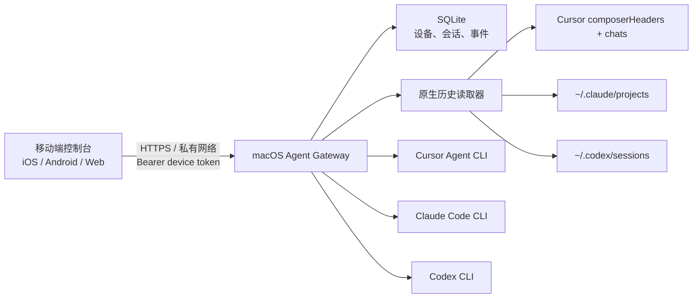

# 架构与协议

> 本文是组件职责、依赖方向和数据流的架构 SSOT。当前功能范围与状态见
> [`product/functional-spec.md`](product/functional-spec.md)，字段级 HTTP/SSE、状态与权限映射见
> [`reference/protocol-contract.md`](reference/protocol-contract.md)。本文中的协议列表只作架构导航，
> 与字段级契约冲突时应修正文档，不能自行选择其一。

## 组件职责

移动端只处理配对、会话列表、历史消息、任务输入、状态呈现和受控会话文件预览，不持有任何 Agent API 密钥。它可以保存最多 8 条 Mac 网关连接并记住上次使用项；Web 联调版把连接库存入 `localStorage`，iOS 原生壳使用 Keychain，Android 原生壳使用 Android Keystore 保护的 AES/GCM 密文。旧版单连接凭据在首次读取时迁移。

移动端后台每 15 秒同步一次会话/历史/配置/设备；启动时仅在安全凭据恢复出的网关 URL 与本地摘要缓存精确匹配时先显示缓存，并并行请求最新状态。打开活动网关会话详情后约每 1 秒拉取增量事件与最新状态；打开活动原生 Codex 详情后约每 1 秒拉取 snapshot，重读新增用户/助手消息与日志推断状态；两者都在终态再同步一次后停止。网关已经提供 SSE，但移动端尚未消费，因此 SSE 仍属于受限实现。

macOS 网关负责认证、目录白名单、统一会话模型、Agent 进程生命周期、JSONL 事件解析、SSE 推送、本地持久化和会话文件桥接。Codex 历史摘要通过 app-server `thread/list` 读取桌面端名称并缓存 15 秒，JSONL 只作为降级和消息正文来源。历史对所有 cwd 可见，目录白名单决定能否从手机新建、续接 Agent 或读取文件；文件还必须 realpath 后位于当前会话 cwd 内。Agent 进程使用固定可执行文件与参数启动，`shell: false`，移动端不能提交任意命令行。

## 统一模型

以下是架构摘要；规范字段和兼容性规则以
[`reference/protocol-contract.md`](reference/protocol-contract.md) 为准。

- Agent：`cursor | claude | codex`
- 权限：`plan | ask | auto`
- 会话状态：`queued | running | waiting_approval | completed | failed | cancelled`
- 事件：`status | output | tool | approval | completed | error`
- 原生历史：统一为 `id / agent / title / cwd / updatedAt / status? / resumable`
- 项目标识：会话可附带 `projectId / projectName`；网关优先识别 Git 根目录，移动端用其跨 Agent 分组
- 历史消息：统一为 `id / role / text / createdAt`

`ask` 在当前非交互式 CLI 适配器中采用受限执行：Cursor/Claude 进入 plan 类模式，Codex 使用只读沙箱。完整的“手机批准单个工具调用后继续”需要下一阶段接入各 Agent 的长期运行协议，而不是放宽当前 CLI 权限。

## HTTP API

以下是路由索引；认证、输入限制、响应 envelope、错误码和 SSE 格式以
[`reference/protocol-contract.md`](reference/protocol-contract.md) 为准。

除 `/v1/health` 与配对接口外都需要 `Authorization: Bearer <device-token>`。

- `POST /v1/pairing/start`：仅允许 Mac 回环地址调用
- `POST /v1/pairing/confirm`：用一次性码换取设备令牌
- `GET /v1/config`、`GET /v1/agents`、`GET /v1/agents/usage`
- `GET /v1/devices`、`POST /v1/devices/:id/revoke`
- `GET /v1/history`、`GET /v1/history/:agent/:id/messages`、`GET /v1/history/:agent/:id/snapshot`
- `POST /v1/history/:agent/:id/resume`
- `POST /v1/history/:agent/:id/files/read`：读取该可续接原生历史 cwd 内的普通文件
- `GET|POST /v1/sessions`
- `GET /v1/sessions/:id/events`：JSON 或 `text/event-stream`
- `POST /v1/sessions/:id/messages`
- `POST /v1/sessions/:id/cancel`
- `POST /v1/sessions/:id/files/read`：读取该会话 cwd 内的普通文件

## 后续演进

1. 用 Codex app-server、Claude SDK/长期会话协议和 Cursor 稳定接口替代短进程 CLI 续接。
2. 增加结构化 approval challenge/resolve 协议与移动端审批卡片。
3. 接入 APNs/FCM 推送通知与原生深链。
4. 增加 Tailscale Serve 或受管中继部署方案，网关仍默认只监听回环地址。

Agent 额度由网关的独立只读探测服务提供并缓存 60 秒。Codex 在 ChatGPT 登录下通过本机 app-server 的 `account/rateLimits/read` 获取窗口，API Key 模式显示 API模式；Cursor 使用 IDE `state.vscdb` 登录态调用 Dashboard `GetCurrentPeriodUsage`；Claude API 模式同样显示 API模式。移动端额度轮询不参与会话/历史的并行加载，因此慢响应或失败不会延迟首页会话。
