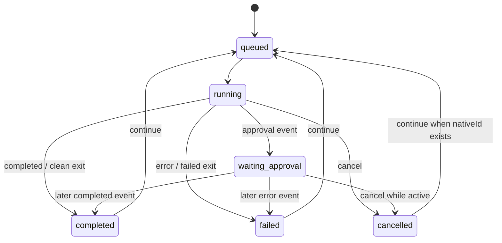

# Remote Agent 跨端协议契约（协议 SSOT）

> 本文规定网关、移动端和 Agent adapter 之间的稳定语义。任何字段、枚举、路由、状态迁移、权限映射或事件格式变化，必须先更新本文并在 [`../quality/feature-matrix.md`](../quality/feature-matrix.md) 中落实测试影响。

## 1. 兼容性原则

- HTTP 路径以 `/v1` 开头。`v1` 内新增可选字段属于向后兼容；删除/重命名字段、改变类型或收紧已有成功条件属于破坏性变更。
- 客户端必须容忍响应中新增字段和未知事件 payload 字段；服务端必须拒绝未知的 Agent、权限枚举和无效输入。
- 事件 `type`、会话 `status` 等封闭枚举不能静默新增。新增枚举值前必须同步网关类型、状态机、移动映射、测试和功能规格。
- 时间使用 ISO 8601 UTC 字符串；ID 作为不透明字符串处理，URL path 中必须 percent-encode。
- 成功响应统一为 `{ "data": T }`，错误响应统一为 `{ "error": { "message": string } }`。
- 所有响应带 `X-Request-Id` 和 `X-Content-Type-Options: nosniff`。普通 JSON 响应使用 `Cache-Control: no-store`；SSE 使用 `no-cache, no-transform`。错误不得包含 secret 或完整不可信输入。

## 2. 核心枚举

### 2.1 Agent

| 值 | CLI | 原生历史默认位置 |
| --- | --- | --- |
| `cursor` | `cursor-agent` | Cursor `composerHeaders`（IDE 侧栏同源）为主；缺库时回退 `~/.cursor/acp-sessions` 与 `~/.cursor/chats` |
| `claude` | `claude` | `~/.claude/projects` |
| `codex` | `codex` | `~/.codex/sessions`（不含 archived） |

### 2.2 权限模式和 adapter 映射

| 协议值 | Cursor | Claude Code | Codex | 当前语义 |
| --- | --- | --- | --- | --- |
| `plan` | `--plan` | `--permission-mode plan` | `sandbox_mode=read-only` | 规划/只读类执行 |
| `ask` | `--plan` | `--permission-mode plan` | `sandbox_mode=read-only` | 当前与受限模式同义；等待未来逐工具审批协议 |
| `auto` | `--auto-review` | `--permission-mode acceptEdits` | `sandbox_mode=workspace-write` | 可在已校验的白名单 cwd 内写入 |

共同约束：

- Cursor 固定使用 `-p --output-format stream-json --workspace <cwd> --trust`。
- Claude 固定使用 `-p --output-format stream-json --verbose --no-chrome`。
- Codex 新会话固定使用 `exec --json --skip-git-repo-check -C <cwd> -s <sandbox>`；续接使用 `exec resume --json --skip-git-repo-check -c sandbox_mode=<...> <nativeId>`，确保白名单内但自身不是 Git 仓库的工作目录也能续接。
- 三者都必须由绝对 executable 直接 spawn，保持 `shell: false`；prompt 只能作为单独 argv，不经过 shell 拼接。

### 2.3 会话状态

| 状态 | 含义 | 可由什么触发 |
| --- | --- | --- |
| `queued` | 会话已持久化，尚未进入 Agent 执行 | 新建或继续请求 |
| `running` | adapter 已开始或收到运行/输出事件 | `GatewayService.launch`、status/output |
| `waiting_approval` | CLI 输出了 approval/permission 类事件 | `approval` 事件；当前无手机 resolve |
| `completed` | CLI 明确完成，或进程以 0 退出且未出现终止事件 | `completed` 事件 |
| `failed` | CLI error、spawn 错误或非零退出且未出现终止事件 | `error` 事件 |
| `cancelled` | 活动进程收到取消 | cancel API 或网关关闭 |

当前状态流：



网关 API 实际以“没有活动进程且存在 `nativeId`”作为继续条件；移动端当前只从已完成/失败/映射后的取消态开放继续。并发继续必须返回错误。

### 2.4 事件

| type | 必要/常见 payload | 作用 |
| --- | --- | --- |
| `status` | `status` 或 `phase` | 生命周期状态 |
| `output` | `stream`, `text` | 用户、助手、stdout/stderr 或 delta 文本 |
| `tool` | `name`，可选 `id/input/command/status` | 工具/命令执行摘要 |
| `approval` | 当前可能含 `raw` | 表示等待 Mac 端权限处理；不得理解为手机可审批 |
| `completed` | 可选 `source/exitCode` | 正常终止 |
| `error` | `message`，可选 `exitCode/signal` | 执行失败 |

持久化事件模型：

```ts
type SessionEvent = {
  seq: number;
  sessionId: string;
  type: "status" | "output" | "tool" | "approval" | "completed" | "error";
  payload: Record<string, unknown>;
  createdAt: string;
};
```

`seq` 是 SQLite 全局自增序号，不保证某个 session 从 1 开始，但在同一 session 内严格递增。客户端只能用它做游标，不应推导事件数量。

## 3. 资源模型

### 3.1 GatewaySession

```ts
type GatewaySession = {
  id: string;
  nativeId?: string;
  agent: "cursor" | "claude" | "codex";
  title: string;
  cwd: string;
  projectId?: string;
  projectName?: string;
  permissionMode: "plan" | "ask" | "auto";
  status: "queued" | "running" | "waiting_approval" | "completed" | "failed" | "cancelled";
  createdAt: string;
  updatedAt: string;
  error?: string;
};
```

`id` 是网关会话 ID；`nativeId` 是 CLI 返回的原生线程/会话 ID。没有 `nativeId` 的会话不能续接。

### 3.2 NativeHistorySession

```ts
type NativeHistorySession = {
  id: string;
  agent: "cursor" | "claude" | "codex";
  title: string;
  cwd: string;
  projectId?: string;
  projectName?: string;
  createdAt?: string;
  updatedAt: string;
  status?: "running" | "completed" | "failed";
  resumable: boolean;
  archived?: boolean;
  source: "native";
};
```

所有本机原生历史均可返回。`status` 是向后兼容的可选字段；当前 Cursor/Claude 默认为 `completed`，Codex 将 app-server 状态与最近 rollout 生命周期事件合并，避免另一个桌面进程中的活动 thread 被 `notLoaded` 误判为完成。cwd 未通过 `REMOTE_AGENT_ROOTS` 真实路径校验时，`resumable=false`，仍可浏览标题和消息，但续接必须返回 409；`status=running` 的记录同样必须拒绝并发续接。`archived` 保留为协议可选字段，但网关不再返回 Codex 存档会话，因此实际响应中不会出现 `archived: true`。

`projectId` 与 `projectName` 是向后兼容的可选项目标识。网关从已校验 cwd 向上查找最近的 Git 根目录（`.git` 文件或目录）；找不到时使用规范化 cwd。`projectId` 是该规范化路径的 SHA-256，不暴露额外路径，`projectName` 是根目录 basename。旧网关未返回字段时，客户端必须回退到 cwd 分组。

### 3.3 NativeHistoryMessage

```ts
type NativeHistoryMessage = {
  id: string;
  role: "user" | "assistant";
  text: string;
  createdAt?: string;
};
```

只包含规范化文本，不包含 system 消息或完整工具参数。Cursor 当前返回空数组。

`GET /v1/history/:agent/:id/snapshot?limit=N` 原子返回 `{ session, messages }`，用于详情首次加载与活动原生 Codex 的近实时轮询。`limit` 与消息接口相同，限制为 1–500。

### 3.4 AgentAvailability

```ts
type AgentAvailability = {
  kind: "cursor" | "claude" | "codex";
  label: string;
  command: string;
  installed: boolean;
  version?: string;
  supportsNativeHistory: boolean;
  permissionModes: Array<"plan" | "ask" | "auto">;
};
```

### 3.5 PairedDevice

```ts
type PairedDevice = {
  id: string;
  name: string;
  createdAt: string;
  lastSeenAt: string;
  current: boolean;
};
```

任何 API 响应都不得包含 token hash。

### 3.6 SessionFile

会话文件读取成功时是本协议唯一的二进制响应，不使用 `{data}` envelope：

- `Content-Type`：由受限扩展名映射产生，未知类型为 `application/octet-stream`。
- `Content-Length`：文件字节数，最大 20 MiB。
- `Content-Disposition`：`inline` 和 RFC 5987 编码文件名。
- `X-Remote-Agent-Filename`：percent-encoded basename，供跨域移动客户端安全显示；不得包含目录。
- `Cache-Control: no-store` 与 `X-Content-Type-Options: nosniff` 保持不变。

输入 `path` 最多 4,096 字符，支持相对路径、绝对路径和本机 `file://` URL。相对路径以资源所属会话 cwd 解析；cwd 必须重新通过 `REMOTE_AGENT_ROOTS`，文件 realpath 必须位于同一 cwd。只返回普通文件，不返回目录、设备文件或越界符号链接。原生历史仅在 `resumable=true` 时允许文件读取。

## 4. 认证、CORS 与输入边界

- 公开接口只有 `GET /v1/health`、`POST /v1/pairing/start`、`POST /v1/pairing/confirm`。
- 其余接口需要 `Authorization: Bearer <device-token>`。token 空值或超过 512 字符视为无效。
- `/v1/pairing/start` 仅接受 `127.0.0.1`、`::1`、IPv4-mapped loopback。
- `/v1/pairing/confirm` 按 remote address 限制为 10 次/60 秒；配对码必须是 6 位数字。
- 默认 body 上限为 1,048,576 bytes。body 必须是 JSON object；未知字段当前被忽略。
- 带 `Origin` 的请求必须精确匹配 `REMOTE_AGENT_ALLOWED_ORIGINS`；无 Origin 的本机/原生请求允许继续。
- `OPTIONS` 返回 204；允许 `GET, POST, OPTIONS` 和 `Authorization, Content-Type, Last-Event-ID`。跨域响应暴露 `Content-Disposition, Content-Length, X-Remote-Agent-Filename`，供文件预览读取元数据。

## 5. HTTP API

### 5.1 路由总表

| 方法与路径 | 认证 | 成功 | 输入 | 输出 data |
| --- | --- | --- | --- | --- |
| `GET /v1/health` | 否 | 200 | — | `{status, hostname, version, now}` |
| `POST /v1/pairing/start` | 回环限定 | 201 | — | `{code, expiresAt}` |
| `POST /v1/pairing/confirm` | 否 | 201 | `{code, deviceName}` | `{token, deviceName}` |
| `GET /v1/devices` | 是 | 200 | — | `PairedDevice[]` |
| `POST /v1/devices/:id/revoke` | 是 | 200 | — | `{id, revoked: true}` |
| `GET /v1/agents` | 是 | 200 | — | `AgentAvailability[]` |
| `GET /v1/agents/usage` | 是 | 200 | — | `AgentUsage[]` |
| `GET /v1/config` | 是 | 200 | — | `{hostname, allowedRoots}` |
| `GET /v1/history` | 是 | 200 | query `agent?`, `limit?`, `perProjectLimit?` | `NativeHistorySession[]` |
| `GET /v1/history/:agent/:id/messages` | 是 | 200 | query `limit?` | `NativeHistoryMessage[]` |
| `GET /v1/history/:agent/:id/snapshot` | 是 | 200 | query `limit?` | `{ session: NativeHistorySession, messages: NativeHistoryMessage[] }` |
| `POST /v1/history/:agent/:id/resume` | 是 | 202 | `{prompt, permissionMode}` | `GatewaySession` |
| `POST /v1/history/:agent/:id/files/read` | 是 | 200 | `{path}` | 二进制 `SessionFile`；只允许可续接历史 cwd 内文件 |
| `GET /v1/sessions` | 是 | 200 | query `agent?`, `limit?` | `GatewaySession[]` |
| `POST /v1/sessions` | 是 | 202 | `{agent, prompt, cwd, permissionMode}` | `GatewaySession` |
| `GET /v1/sessions/:id` | 是 | 200 | — | `GatewaySession` |
| `GET /v1/sessions/:id/events` | 是 | 200 | query `after?` 或 `Last-Event-ID` | JSON `SessionEvent[]` 或 SSE |
| `POST /v1/sessions/:id/messages` | 是 | 202 | `{prompt}` | `GatewaySession` |
| `POST /v1/sessions/:id/cancel` | 是 | 200 | — | `GatewaySession` |
| `POST /v1/sessions/:id/files/read` | 是 | 200 | `{path}` | 二进制 `SessionFile`；只允许该会话 cwd 内文件 |

### 5.2 字段限制

| 字段 | 规则 |
| --- | --- |
| `code` | 必填字符串，最多 6 字符，必须匹配 `^\d{6}$` |
| `deviceName` | trim 后非空，最多 80 字符 |
| `prompt` | trim 后非空，最多 50,000 字符 |
| `cwd` | trim 后非空，最多 4,096 字符；必须是存在的绝对路径，realpath 后位于 allowed roots |
| `path` | trim 后非空，最多 4,096 字符；相对、绝对或 `file://`，realpath 后必须位于资源所属会话 cwd，普通文件且不超过 20 MiB |
| `agent` | 必须是 Agent 枚举 |
| `permissionMode` | 必须是权限枚举 |
| `id` | URL decode 后按资源处理；原生历史 ID 额外要求 1–200 字符且只含字母、数字、点、下划线、连字符 |
| `limit` / `after` | 非负整数；无效时使用路由默认值，资源服务再应用上下限 |

### 5.3 Agent 额度快照

`AgentUsage` 对 Cursor、Claude、Codex 各返回一项：

- `agent`：Agent 枚举。
- `state`：`available | unavailable`。
- `windows`：可用时为额度窗口数组；每项包含用户可读 `label`、`remainingPercent`（0–100）和可选 ISO `resetsAt`。
- `message`：不可用时的安全说明，必须包含“无法获取额度信息”，不得包含账号、token、CLI 原始输出或上游响应正文。
- `updatedAt`：网关生成快照的 ISO 时间。

网关只允许固定的只读探测命令或固定 Dashboard RPC，且保持 `shell: false`。Codex 在 ChatGPT 登录下使用官方 app-server `account/rateLimits/read`，优先读取 `rateLimitsByLimitId.codex`，兼容单桶 `rateLimits`；`~/.codex/auth.json` 的 `auth_mode` 为 API（或仅有 API Key）时返回 `API模式`。Cursor 使用本机 IDE 登录态调用 `GetCurrentPeriodUsage`，映射 `planUsage.remaining/limit` 为本月剩余比例。Claude/Codex API 模式没有订阅额度窗口或上游暂时失败时返回 `unavailable`，不能猜测剩余值。结果在网关缓存 60 秒；额度探测与会话同步相互独立。响应不得包含账号邮箱、token 或上游原始正文。

### 5.4 常见错误语义

| HTTP | 场景 |
| --- | --- |
| 400 | JSON 无效、字段缺失/过长、未知枚举 |
| 401 | token 缺失、无效或已撤销；配对码无效/过期也返回 401 |
| 403 | 非回环生成配对码、Origin 不在 allowlist、文件越出会话 cwd、只读原生历史读取文件 |
| 404 | 路由、设备、会话、原生历史或文件不存在 |
| 409 | 原生历史只读、不能续接 |
| 413 | body 或会话文件超过上限 |
| 429 | 配对确认尝试过多 |
| 500 | cwd 校验、Agent 缺失/启动、会话状态等当前未分类错误；不得泄露敏感上下文 |

新增错误分类可以从 500 改为更明确的 4xx，但客户端不能依赖错误文案做业务分支；需要结构化 error code 时必须作为显式协议变更设计。

## 6. 事件传输

### 6.1 JSON 拉取

`GET /v1/sessions/:id/events?after=N` 返回 `seq > N` 的升序事件。当前默认最多 500 条，store 上限 2,000 条。移动端保存本地最大 seq 并轮询。

### 6.2 SSE

请求头包含 `Accept: text/event-stream` 时：

```text
: connected

id: <seq>
event: <type>
data: <完整 SessionEvent JSON>

```

- 建连后先补发 `after` / `Last-Event-ID` 之后的持久化事件，再订阅新事件。
- 每 15 秒发送 `: heartbeat`。
- 连接关闭时必须取消订阅和 heartbeat。
- SSE 的 `data` 是完整 `SessionEvent`，不是仅 payload。

移动端接入 SSE 前必须补：断线重连、游标恢复、重复事件去重、认证失效、前后台切换测试；在此之前 `STREAM-002` 保持受限实现。

## 7. 持久化契约

- 数据目录默认 `~/.remote-agent`，目录权限 `0700`，SQLite 文件权限 `0600`。
- SQLite 开启 WAL 与 foreign keys。
- `devices` 只保存 `token_hash`，不保存明文 token。
- `sessions` 保存网关/原生 ID、Agent、cwd、权限、状态、时间和可选错误。
- `events` 通过 foreign key 关联 session；删除 session 时级联删除事件，但当前没有公开删除会话 API。
- 配对码只保存在进程内存；网关重启后失效。
- 活动子进程只保存在内存；网关重启不会自动恢复“运行中”任务。数据库中的旧状态可能仍为 running，这是当前恢复限制，不能在 UI 中解释为进程仍真实存活。

## 8. 原生历史读取契约

- 单次扫描最多遍历 5,000 个目标扩展名文件。
- 摘要只读取文件前 256 KiB；消息只读取文件末尾最多 8 MiB。
- Claude/Codex 消息限制为最近 1–500 条，默认 100；单条规范化文本最多 20,000 字符。
- Codex 摘要优先来自 app-server `thread/list`（仅 `archived=false` 的活跃会话），使用 `thread.name` 作为标题并分页读取；结果缓存 15 秒。app-server 不可用时回退扫描 `~/.codex/sessions` JSONL，并按 session id 去重。`archived_sessions` 与 `thread/list` 的 archived 分页均不读取。
- 历史列表不按 cwd 隐藏；网关将白名单外记录规范化为 `resumable=false`。`limit` 最大 2,000，`perProjectLimit` 默认 20、最大 100，按 Agent + 项目分别计数。
- 文件缺失、权限不足、单行 JSON 无效时跳过对应文件/行，而不是使整个列表失败。
- list/get/messages 允许读取白名单外本机历史；resume 和所有启动 Agent 的路径必须再次应用 allowed roots，不能依赖客户端传入的 `resumable`。
- Cursor 摘要优先读取 IDE `state.vscdb` 的 `composerHeaders`（与 Workspaces 侧栏同一索引）：使用 `name` 作为标题，跳过 archived / draft / subagent；多根工作区从 `.code-workspace` 解析首个 folder 作为 cwd。Glass/composer 会话默认 `resumable=true`（`cursor-agent --resume <id>`），cwd 未通过白名单时仍会被规范化为只读。Composer DB 不可用时回退扫描 `acp-sessions`（只读）+ `chats`（可续接）的 `meta.json`。Cursor messages 当前仍为空。
- Cursor 的 `acp-sessions/store.db` 和 `chats/*/*/store.db` 消息正文仍不解析；仅读取 `composerHeaders` 索引字段与 `meta.json` 摘要。

## 9. 环境变量合同

| 变量 | 默认值 | 契约 |
| --- | --- | --- |
| `REMOTE_AGENT_HOST` | `127.0.0.1` | 监听地址；改为 `0.0.0.0` 必须满足安全部署要求 |
| `REMOTE_AGENT_PORT` | `17821` | 正整数，否则回退默认值 |
| `REMOTE_AGENT_DATA_DIR` | `~/.remote-agent` | SQLite/服务数据目录 |
| `REMOTE_AGENT_ROOTS` | 当前 cwd | macOS 用 `:` 分隔；新建/续接任务的执行授权边界，不影响历史可见性 |
| `REMOTE_AGENT_ALLOWED_ORIGINS` | `http://localhost:4173,capacitor://localhost,https://localhost` | 逗号分隔精确 origin |
| `REMOTE_AGENT_PAIRING_TTL_MS` | `300000` | 配对码 TTL，正整数 |
| `REMOTE_AGENT_MAX_BODY_BYTES` | `1048576` | HTTP body 上限，正整数 |
| `REMOTE_AGENT_CURSOR_HISTORY_DIR` | `~/.cursor/acp-sessions` | Cursor 旧历史 |
| `REMOTE_AGENT_CURSOR_CHATS_HISTORY_DIR` | `~/.cursor/chats` | Cursor chats store（用于可续接标记） |
| `REMOTE_AGENT_CURSOR_COMPOSER_DB` | `~/Library/Application Support/Cursor/User/globalStorage/state.vscdb` | Cursor IDE 会话索引（标题/归档） |
| `REMOTE_AGENT_CLAUDE_HISTORY_DIR` | `~/.claude/projects` | Claude 历史 |
| `REMOTE_AGENT_CODEX_HISTORY_DIR` | `~/.codex/sessions` | Codex 活跃历史（不含归档） |
| `VITE_REMOTE_AGENT_URL` | 空 | Web 初始网关 URL；不能承载 token |

## 10. 协议变更检查

任何协议变更至少必须：

1. 关联一个已有或新增功能 ID。
2. 先更新本文的模型、路由或状态语义。
3. 同步 `macos-agent-gateway/src/types.ts`、`http.ts`、`service.ts`、相关 adapter/store/history。
4. 同步移动端 API 类型、映射、请求和错误态。
5. 为兼容与失败路径补自动化测试；事件变更同时测 JSON 和 SSE。
6. 更新 `functional-spec.md` 状态、`feature-matrix.md` 追踪关系和架构/安全文档中受影响部分。
7. 在验收记录中说明兼容性：兼容、迁移期或破坏性，并给出回滚/升级策略。
